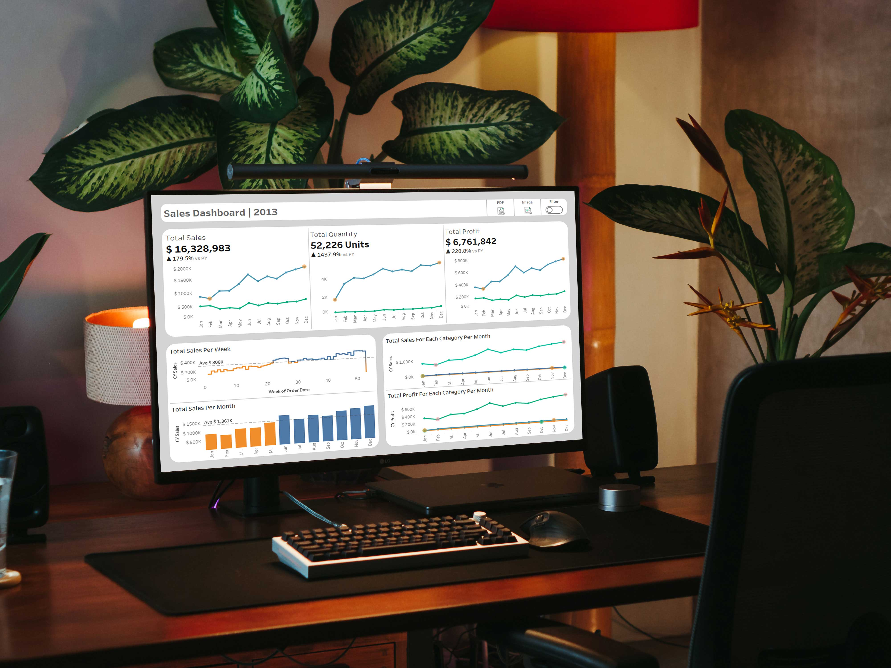

# VelociMart Business Insights

## 📚 Table of Contents

1. [Project Background](#1-project-background)  
   - [Data Engineering](#️data-engineering)  
   - [Data Analysis](#data-analysis)  
   - [Data Visualization](#️data-visualization)  
2. [Data Structure](#2-data-structure)  
   - [Data Architecture](#️data-architecture)  
   - [Integration Model](#integration-model)  
   - [Data Flow Diagram](#data-flow-diagram)  
   - [Sales Data Mart (Star Schema)](#sales-data-mart-star-schema)  
   - [Data Catalog](#️data-catalog)  
3. [Executive Summary](#3-executive-summary)  
   - [Key Takeaways](#key-takeaways)  
4. [Recommendations](#4-recommendations)

## 1) Project Background

**VelociMart** is a dynamic e-commerce company founded in 2010, specializing in the sale of high-performance cycling gear and accessories. Their product catalog spans Bikes, Components, Clothing, and Accessories, catering to both casual riders and professional cyclists.

To keep up with business growth and evolving decision-making needs, VelociMart needed to transition from Excel-based reporting to a **scalable, reliable data platform**. This project was initiated to help the company unlock deeper insights from their data using **SQL Server** for warehousing and **Tableau** for visualization.

The project focuses on delivering insights and recommendations for VelociMart’s leadership, especially the Chief Revenue Officer (CRO), in the following key areas:

- Year-over-year growth in sales and profit  
- Monthly and seasonal performance trends  
- Weekly sales monitoring to track progress against targets  
- High and low-performing periods across product categories and timeframes  

---

### ⚙️ Data Engineering

Scripts for building the data warehouse using the **Medallion Architecture**:

- 🟤 [Bronze Layer](scripts/bronze) — Raw data ingestion  
- ⚪ [Silver Layer](scripts/silver) — Cleaned and conformed data  
- 🟡 [Gold Layer](scripts/gold) — Analytical, business-ready data marts  

Data quality checks to ensure accurate and reliable analysis:

- 🧪 [Silver Layer Quality Checks](tests/quality_checks_silver.sql)  
- 🧪 [Gold Layer Quality Checks](tests/quality_checks_gold.sql)

---

### 📊 Data Analysis

SQL logic for preparing the sales data for reporting:

- 📄 [Sales Report SQL Script](scripts/reports/sales_report.sql)

---

### 📈 Data Visualization

CRO dashboard was built in **Tableau Public**, providing rich, visual insights for decision-makers:

- 🌐 [View CRO Dashboard in Tableau Public](https://public.tableau.com/shared/HBWCH3TXQ?:display_count=n&:origin=viz_share_link)

## 2) Data Structure

This section highlights the core structure and modeling approach used in VelociMart’s data warehouse. It covers the architecture, flow, and star schema modeling that enabled effective analysis and reporting.

---

### 🏗️ Data Architecture

An overview of how the data warehouse was designed using the **Medallion Architecture** (Bronze → Silver → Gold).  
📎 [View Diagram](docs/Data%20Architecture.jpg)

---

### 🔗 Integration Model

Illustrates the structure of the raw data from VelociMart’s **CRM and ERP systems** before transformation.  
📎 [View Diagram](docs/Integration_Model.jpg)

---

### 🔄 Data Flow Diagram

Demonstrates the journey of data from the source systems through the **Bronze**, **Silver**, and into the **Gold layer**, ready for analysis.  
📎 [View Diagram](docs/Data%20Flow%20Diagram.jpg)

---

### 📊 Sales Data Mart (Star Schema)

Visual representation of the **Sales Data Mart** modeled as a **Star Schema**, comprising:
- A central **Sales Fact Table**
- Linked **Customers** and **Products** Dimension Tables

---

### 🗂️ Data Catalog

A comprehensive documentation of the Sales Data Mart tables, including **columns, data types, and descriptions**.  
📎 [View Data Catalog](docs/data_catalog.md)

## 3) Executive Summary

This report provides a high-level overview of VelociMart's sales, profit, and quantity performance trends from 2010 to 2014, highlighting significant growth patterns, seasonal fluctuations, and category performance across the years.

🔗 [View Interactive Dashboard](https://public.tableau.com/shared/HBWCH3TXQ?:display_count=n&:origin=viz_share_link)

---

### 🧠 Key Takeaways (2013 vs 2012)

- **Massive business turnaround**:
  - Sales soared from **$5.84M (2012)** to **$16.3M (2013)** — a **179.5% increase**.
  - Profit more than tripled from **$2.05M** to **$6.76M** — a **228.8% surge**.
  - Units sold exploded from **3,396 units** to **52,226 units** — a **1,437.9% increase**.

- **Category performance**:
  - **Bikes** remained the top revenue driver, with December peaking at **$1.74M** in sales and **$721K** in profit.
  - **Accessories and Clothing** showed notable growth in 2013, especially in December.

- **Seasonality insights**:
  - **February** was the lowest-performing month with **$704K in sales** and **$283K in profit**.
  - **December** was the best month, achieving **$1.74M in sales** and **$721K in profit**, underscoring strong holiday demand.

## 4) Recommendations

Based on the analysis of historical performance trends, category performance, and seasonal fluctuations, the following actions are recommended to sustain growth and drive better business outcomes:

- **Double down on Bikes category**  
  Bikes generated the highest revenue and profit in 2013, peaking at **$1.74M** in sales and **$721K** in profit in December. Prioritize marketing, inventory management, and supply chain optimization around the Bikes category to maintain and expand this dominant position.

- **Capitalize on peak seasons**  
  December (sales: **$1.74M**, profit: **$721K**) and June (high seasonal peaks in prior years) consistently outperform other months. Ramp up inventory, promotional campaigns, and customer engagement initiatives leading into these months to maximize conversion and revenue.

- **Address February sales slump**  
  February remained the lowest-performing month in 2013 with **$704K** in sales and **$283K** in profit. Launch targeted promotions such as Valentine’s Day bundles, flash sales, or loyalty incentives to stimulate mid-winter demand.

- **Leverage Accessories and Clothing growth**  
  Accessories and Clothing categories demonstrated strong secondary growth, especially in December. For example, Accessories played a major supporting role during the December sales peak. Implement cross-sell strategies by bundling Accessories and Clothing with Bikes to boost average order value and diversify revenue streams.
