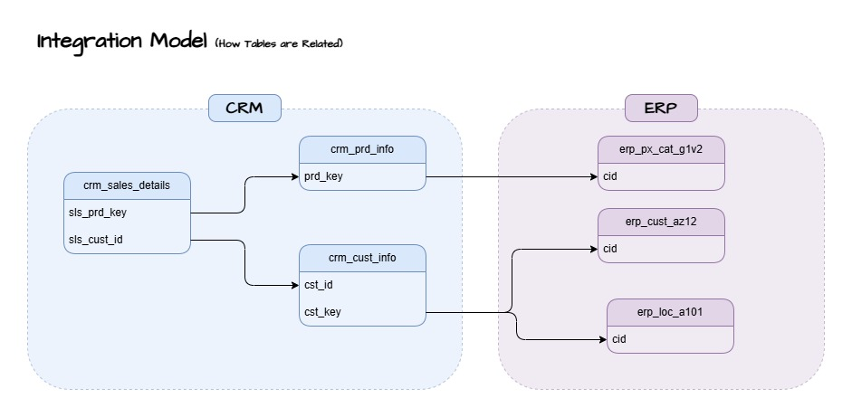

# Data Warehouse and Analytics Projects

Welcome to the **Data Warehouse and Analytics Project** repository.
This project demonstrates a comprehensive data warehousing and analytics solution, from building a data warehouse to generating actionable insights.

---

## 1) Data Engineering: Building the Data Warehouse

### Project Overview
This project involves building a **modern data warehouse** using **SQL Server** to consolidate sales data from **CRM** and **ERP** sources. The warehouse follows the **Medallion Architecture**, ensuring data quality, transformation, and ease of analytical consumption.

### 1.0) Data Architecture

### 1.1) Database & Schema Creation

Before loading data into the **Data Warehouse**, we first need to create the **database** and **schemas** to support the Medallion Architecture (**Bronze, Silver, Gold Layers**).

📜 SQL Script: [`scripts/init_database.sql`](scripts/init_database.sql)

This script:
- Creates the **DataWarehouse** database.
- Defines **three schemas**: `bronze`, `silver`, and `gold` for data segregation.

### 1.2) Bronze Layer - Raw Data Tables  

The **Bronze Layer** stores raw data ingested from **CRM** and **ERP** sources. No transformations are performed at this stage.  

📜 SQL Script: [`scripts/bronze/ddl_bronze.sql`](scripts/bronze/ddl_bronze.sql)  

This script:  
- Creates **3 CRM** and **3 ERP** tables in the **bronze schema**.  
- Ensures existing tables are dropped before re-creation.

### 1.3) Bronze Layer - Data Loading  

The **Bronze Layer** is loaded using a stored procedure that:  
- **Truncates** existing data to avoid duplicates.  
- Uses **BULK INSERT** to load data from **CSV files** into Bronze tables.  
- Logs the start and end times for performance tracking.  
- Implements **error handling** to capture issues during data loading.  

📜 SQL Script: [`scripts/bronze/proc_load_bronze.sql`](scripts/bronze/proc_load_bronze.sql)  

### 1.4) Data Flow Diagram  

 

This diagram illustrates how data flows from **CRM** and **ERP** source systems into the **Bronze Layer** of the data warehouse.  

📌 **Sources:**  
- **CRM** → Customer, product, and sales data  
- **ERP** → Customer, location, and pricing data  

📌 **Bronze Layer Tables:**  
- `crm_cust_info`  
- `crm_prd_info`  
- `crm_sales_details`  
- `erp_cust_az12`  
- `erp_loc_a101`  
- `erp_px_cat_g1v2`  

### 1.5) Silver Layer - Data Exploration & Understanding

To efficiently transform data from the **Bronze Layer** into the **Silver Layer**, it is essential to understand the purpose of each table.

#### 📌 Data Breakdown

| **Table Name**        | **Description**  |
|-----------------------|----------------|
| `crm_cust_info`      | Contains details and descriptions of customers. |
| `crm_prd_info`       | Holds product history and attributes. |
| `crm_sales_details`  | An event and transactional table for sales and orders. Can be used to connect with other tables. |
| `erp_cust_az12`      | Additional customer details from the ERP system. |
| `erp_loc_a101`       | Stores location-related customer data. |
| `erp_px_cat_g1v2`    | Provides extra information about products. |

#### 🔗 Integration Model (Table Relationships)

Understanding how the tables are connected helps define the **Silver Layer transformations**.

### 1.6) Silver Layer Table Definitions

The Silver layer represents the **cleaned and structured version** of the raw data ingested into the Bronze layer. This stage includes additional metadata columns like `dwh_create_date`, which records the timestamp when the data entered the Silver layer — critical for auditability and tracking freshness of data.

### 💡 Purpose:
- To clean, standardize, and structure the raw Bronze data for analytical use.
- To prepare datasets that are easier to **join**, **filter**, and **analyze** in the Gold layer.
- To ensure **data integrity** by including creation timestamps via the `dwh_create_date` column.
- To retain schema similarity to the Bronze layer while applying transformations as needed.

📄 Script Location: `scripts/silver/ddl_silver.sql`

---

### Data Analytics: BI Analytics & Reporting

#### Objective
Develop SQL based analytics to deliver detailed insights into:
- **Customer Behaviour**
- **Product Performance**
- **Sales Trends**

These insights empower stakeholders with key business metrics, enabling strategic decision making.
